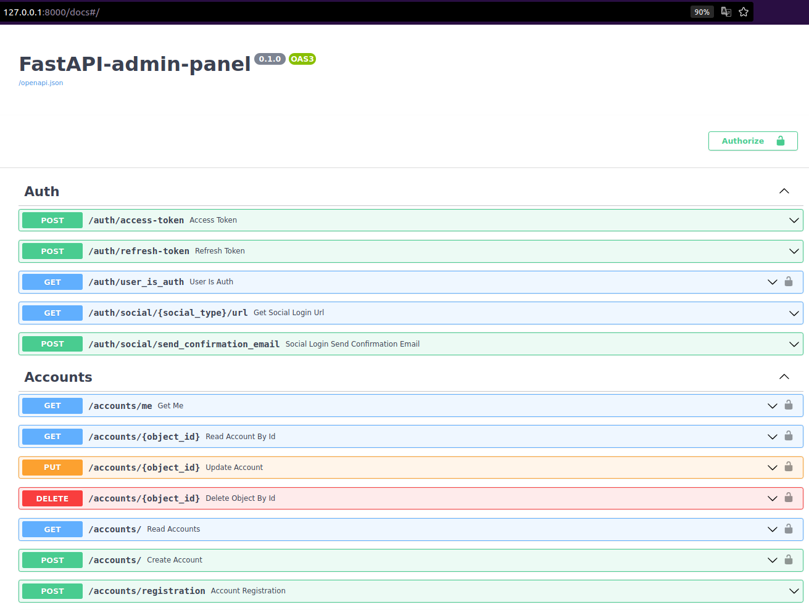
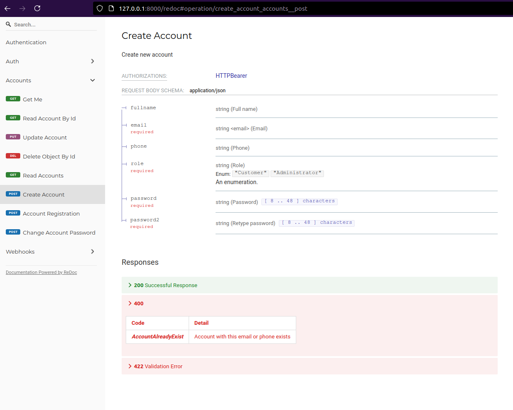

# FastAPI and PostgreSQL - Admin Panel


[](https://www.python.org/downloads/release/python-390/)

[](https://github.com/Naereen/StrapDown.js/blob/master/LICENSE)


Backend stack using Python , including interactive API documentation and many useful features out of the box.


## Interactive API documentation




## Alternative API documentation




## Features

* Full **Docker** integration (Docker based).

* **Docker Compose** integration.

* **Production ready** Python web server using Uvicorn.

* Python **FastAPI** backend.

* **Secure password** hashing by default.

* **JWT token** authentication.

* **SQLAlchemy** models.

* **Alembic** migrations.

* **CORS** (Cross Origin Resource Sharing).

* REST backend tests based on **Pytest**, integrated with Docker, so you can test the full API interaction, independent on the database. As it runs in Docker, it can build a new data store from scratch each time.

* **Secure docs** behind basic http auth.

* **Sentry** integration (application monitoring and error tracking).

* **SendGrid** integration (email delivery service).

* **Email confirmation** when registering a user.

* Integration with **Social Networks** (Vkontake, Facebook, Gmail).

* Beauty mixins for **Asynchronous SQLAlchemy**.


## How to use it

### Generate passwords

You will be asked to provide passwords and secret keys for several components. Open another terminal and run:

```
openssl rand -hex 32
# Outputs something like: 99d3b1f01aa639e4a76f4fc281fc834747a543720ba4c8a8648ba755aef9be7f
```

### Environment variables

The input variables, with their default values:

* `PROJECT_NAME`: The name of the project

* `VERSION`: Project version

* `SERVER_DOMAIN`: The domain in where to deploy the project. By default, based on the `http://localhost:8000`.

* `FIRST_SUPERUSER_LOGIN`: The first superuser generated, with it you will be able to create more users, etc.

* `FIRST_SUPERUSER_PASSWORD`: First superuser password. Use the method above to generate it.

* `DOCS_ADMIN_USERNAME`: Username for basic http auth of secure docs.

* `DOCS_ADMIN_PASSWORD`: Password for basic http auth of secure docs.

* `ENV`: Environment mode, like DEV or PROD.

* `SENTRY_DSN`: Key URL (DSN) of Sentry, for live error reporting.

* `AUTH_SECRET_KEY`: Backend server secret key. Use the method above to generate it.

* `EMAIL_SEND_MODE`: Send emails via post service. By default off and show message context on output.

* `SEND_GRID_KEY`: Key of SendGrid, for sending emails.

Other environment variables could be found in `env.template` of `backend` directory.


### How to deploy

* Create `.env` file in `backend` directory with settings from `.env.template`.

* Run command `docker-compose up --build -d`.

* Check URL `http://127.0.0.1:8000`. By default for secure docs use credentials: `admin:admin`.
